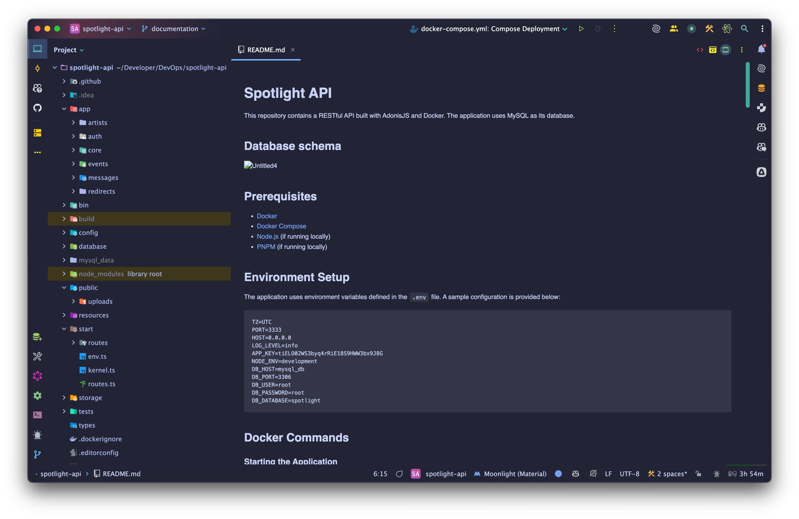
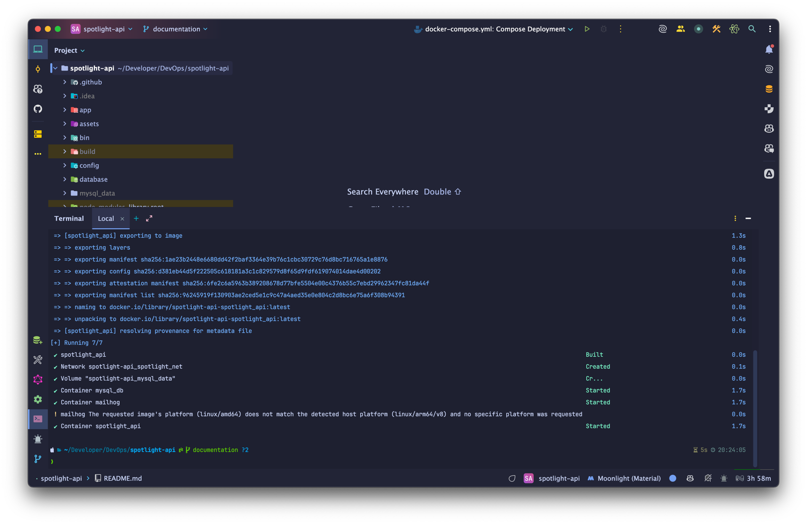
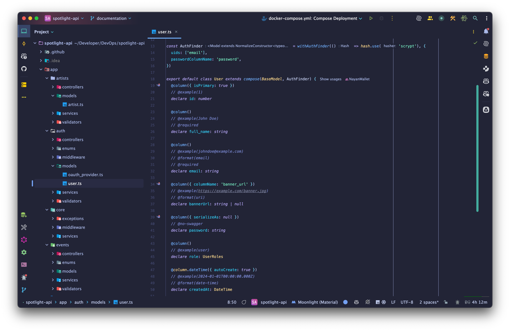
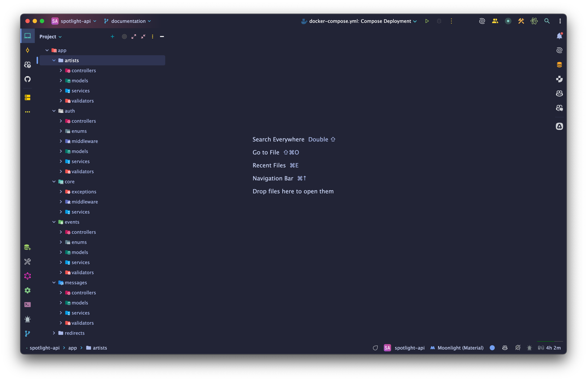
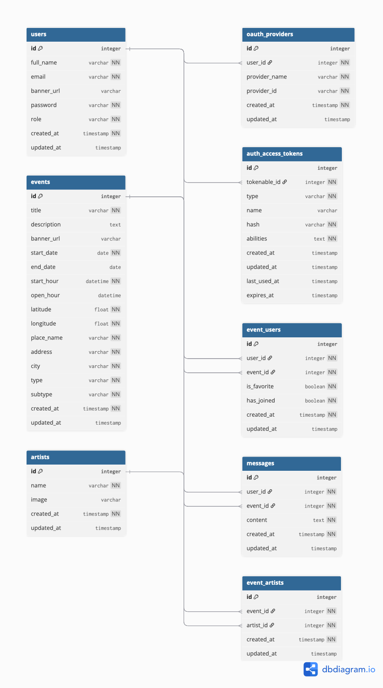
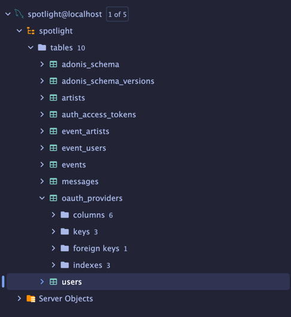
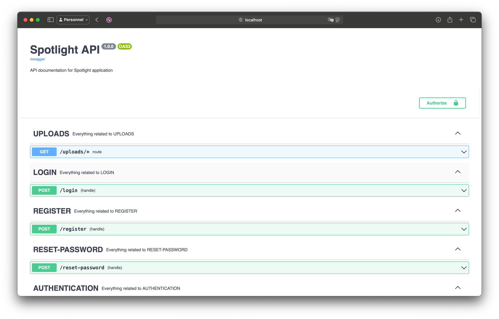
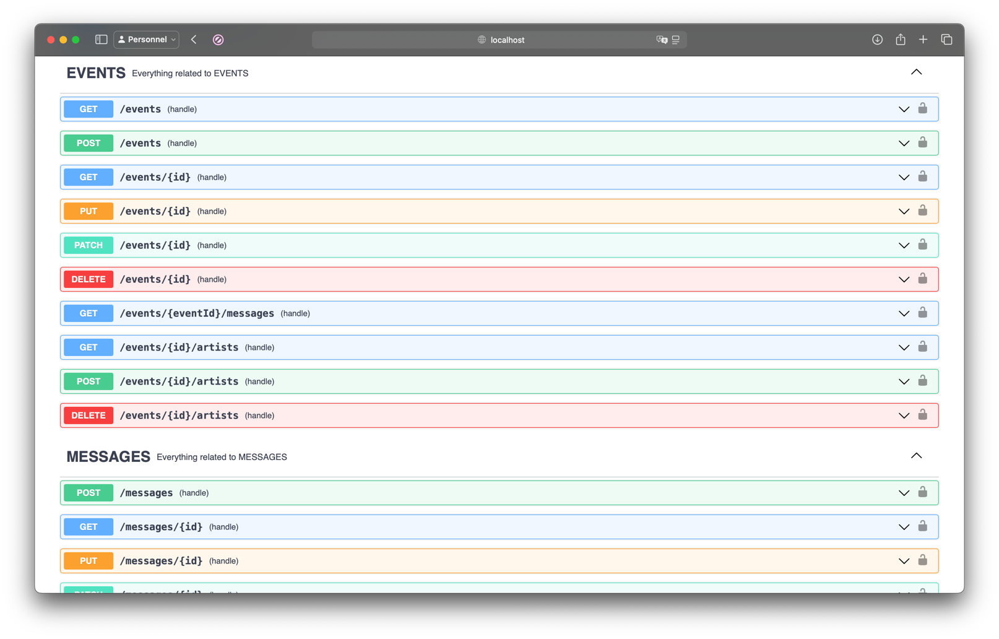
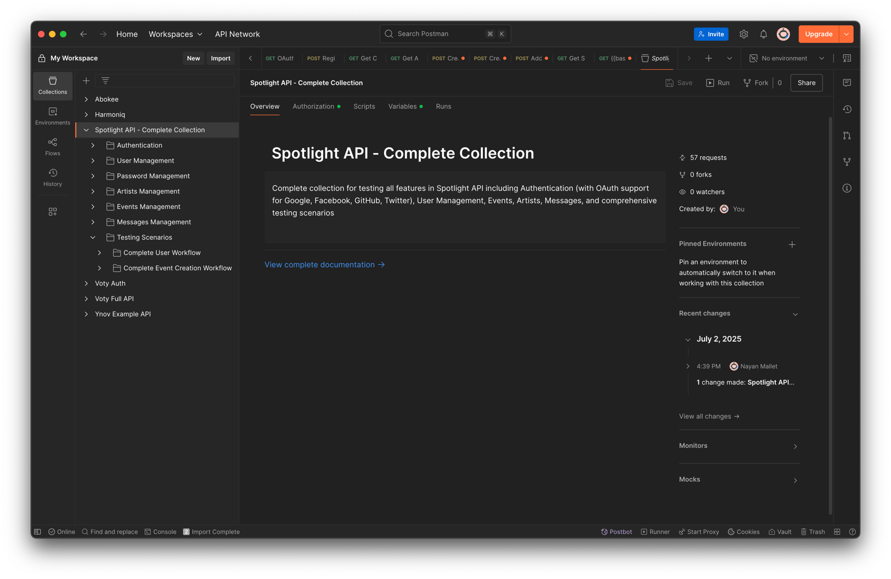
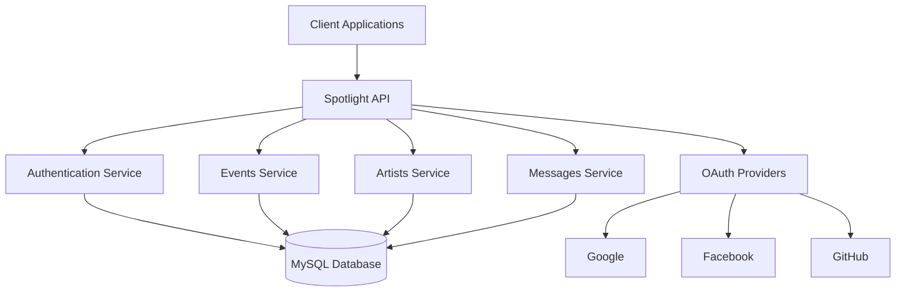

# Présentation du Projet EventConnect - Plateforme de Gestion d'Événements Collaboratifs

## 1. Environnement de travail

### Technologies et outils choisis

**IDE et outils de développement :**
- **Visual Studio Code** : Choisi pour sa flexibilité, ses extensions TypeScript/Node.js et son intégration Git native
- **Git + GitHub** : Contrôle de version avec repository public pour la collaboration et le suivi des modifications
- **PNPM** : Gestionnaire de paquets performant, plus rapide que npm avec une meilleure gestion de l'espace disque

**Stack technique :**
- **Backend** : Node.js avec AdonisJS v6 (framework TypeScript moderne)
- **Base de données** : MySQL avec Lucid ORM pour les relations complexes
- **Authentification** : JWT + OAuth2 (Google)
- **Documentation** : Swagger/OpenAPI avec Adonis AutoSwagger

[//]: # (- **Tests** : Framework Japa pour les tests unitaires et d'intégration)
- **Containerisation** : Docker + Docker Compose pour l'environnement de développement

**Configuration de l'environnement :**
```bash
# Installation des dépendances
pnpm install

# Configuration Docker
docker-compose up -d

# Migrations de base de données
docker-compose exec spotlight_api node ace migration:run
```


*


### Lien avec CDA :
**Bloc 1 : Installer et configurer son environnement de travail en fonction du projet**

Cette compétence a été validée par :
- La mise en place d'un environnement de développement complet avec Docker
- La configuration d'outils adaptés au développement TypeScript/Node.js
- L'intégration de Git avec des conventions de commit structurées
- La documentation complète des étapes d'installation dans le README.md

---

## 2. Architecture logicielle

### Architecture multicouche

**Architecture adoptée : Domain-Driven Design (DDD) avec séparation en couches**

```
app/
├── artists/          # Domaine Artistes
├── auth/            # Domaine Authentification
├── events/          # Domaine Événements
├── messages/        # Domaine Messages
└── core/           # Fonctionnalités partagées

Chaque domaine contient :
├── controllers/     # Couche Présentation (HTTP)
├── services/       # Couche Métier (Business Logic)
├── models/         # Couche Données (ORM)
├── validators/     # Validation des entrées
└── enums/         # Types et constantes
```

**API REST avec progression vers HATEOAS :**
- Endpoints RESTful respectant les conventions HTTP
- Codes de statut appropriés (200, 201, 400, 401, 404, 500)
- Pagination et filtrage des ressources
- Documentation Swagger complète
- Gestion d'erreurs centralisée

**Framework et justifications :**
- **AdonisJS** : Framework TypeScript mature avec ORM intégré, système d'authentification robuste
- **Architecture modulaire** : Séparation claire des responsabilités par domaine métier
- **Inversion de dépendances** : Services injectés pour faciliter les tests



*

### Lien avec CDA :
**Bloc 2 : Définir l'architecture logicielle d'une application**
**Bloc 2 : Analyser les besoins et maquetter une application**

Ces compétences ont été validées par :
- La conception d'une architecture multicouche respectant les principes SOLID
- L'analyse des besoins métier traduite en modules fonctionnels distincts
- La définition claire des responsabilités de chaque couche
- La documentation de l'architecture dans le README et les diagrammes

---

## 3. Sécurité

### Système d'authentification sécurisée

**Authentification multi-méthodes :**
- **JWT (JSON Web Tokens)** : Tokens sécurisés avec expiration
- **OAuth2** : Intégration Google via AdonisJS Ally
- **Authentification classique** : Email/mot de passe avec hashage bcrypt
- **Reset de mot de passe** : Système de tokens temporaires sécurisés

**Validation et sécurisation :**
```typescript
// Exemple de validation avec VineJS
export const createEventValidator = vine.compile(
  vine.object({
    title: vine.string().minLength(3).maxLength(255),
    description: vine.string().optional(),
    start_date: vine.date(),
    latitude: vine.number().range(-90, 90),
    longitude: vine.number().range(-180, 180)
  })
)
```

**Gestion des rôles et permissions :**
- **Rôle User** : Consultation d'événements, participation, messages
- **Rôle Admin** : Création d'événements, Modération des utilisateurs et événements
- **Middleware d'autorisation** : Contrôle d'accès par endpoint

**Mesures de sécurité implémentées :**
- Validation stricte des entrées (prévention XSS, injection SQL)
- CORS configuré pour les domaines autorisés
- Sanitisation des données utilisateur
- Gestion sécurisée des fichiers uploadés

*[CAPTURE D'ÉCRAN : Interface de connexion avec options OAuth]*

*[CAPTURE D'ÉCRAN : Code montrant les validateurs et middleware de sécurité]*

### Lien avec CDA :
**Bloc 1 : Développer une application sécurisée**

Cette compétence a été validée par :
- L'implémentation d'un système d'authentification robuste multi-méthodes
- La mise en place de validations strictes pour prévenir les vulnérabilités
- La gestion appropriée des rôles et permissions utilisateur
- L'application des bonnes pratiques de sécurité (hashage, tokens, CORS)

---

## 4. Base de données

### Modèle relationnel MySQL

**Choix de la base de données relationnelle :**
MySQL a été choisi pour sa robustesse, sa performance et sa compatibilité avec les relations complexes du projet.

**Modèle de données MERISE :**

**Entités principales :**
- **Users** : Utilisateurs avec profils et rôles
- **Events** : Événements avec géolocalisation et catégorisation
- **Artists** : Artistes associés aux événements
- **Messages** : Système de communication par événement
- **OAuth_Providers** : Gestion des comptes liés

**Relations clés :**
- Users ↔ Events (M:N) : Participation et favoris via `event_users`
- Events ↔ Artists (M:N) : Association via `event_artists`
- Users → Messages (1:N) : Messages par utilisateur
- Events → Messages (1:N) : Messages par événement

**Diagramme conceptuel :**
```sql
-- Exemple de structure
CREATE TABLE events (
  id INT PRIMARY KEY AUTO_INCREMENT,
  title VARCHAR(255) NOT NULL,
  description TEXT,
  start_date DATE NOT NULL,
  latitude FLOAT NOT NULL,
  longitude FLOAT NOT NULL,
  place_name VARCHAR(255) NOT NULL,
  type ENUM('concert', 'festival', 'exhibition', 'conference'),
  created_at TIMESTAMP DEFAULT CURRENT_TIMESTAMP
);
```

**Optimisations :**
- Index sur les colonnes de recherche fréquente (date, localisation, type)
- Contraintes d'intégrité référentielle
- Normalisation 3NF respectée





### Lien avec CDA :
**Bloc 2 : Concevoir et mettre en place une base de données relationnelle**
**Bloc 2 : Développer des composants d'accès aux données SQL et NoSQL**

Ces compétences ont été validées par :
- La conception d'un modèle de données relationnel complet avec diagrammes MERISE
- L'implémentation des relations complexes (1:N, M:N) avec tables de liaison
- L'utilisation de l'ORM Lucid pour l'accès aux données avec requêtes optimisées
- La mise en place de migrations et seeders pour la gestion de la structure

---

## 5. API

### API REST complète et documentée

**Endpoints majeurs implémentés :**

1. **Authentification** (`/auth`)
   - `POST /register` : Inscription utilisateur
   - `POST /login` : Connexion
   - `GET /oauth/:provider` : Authentification OAuth
   - `POST /forgot-password` : Reset mot de passe

2. **Gestion des événements** (`/events`)
   - `GET /events` : Liste avec pagination et filtres
   - `POST /events` : Création d'événement
   - `GET /events/:id` : Détails d'un événement
   - `PUT /events/:id` : Modification complète
   - `DELETE /events/:id` : Suppression

3. **Gestion des artistes** (`/artists`)
   - CRUD complet avec endpoints RESTful
   - Association avec événements via `/events/:id/artists`

4. **Système de messages** (`/messages`)
   - `POST /messages` : Création de message
   - `GET /events/:eventId/messages` : Messages par événement

5. **Gestion utilisateurs** (`/users`)
   - Profil utilisateur, upload de bannière
   - Gestion des comptes OAuth

**Documentation Swagger :**
- Spécification OpenAPI 3.0 complète
- Interface interactive accessible via `/docs`
- Exemples de requêtes/réponses pour chaque endpoint
- Schémas de validation documentés

**Gestion des erreurs :**
```typescript
// Exemple de gestion d'erreur structurée
{
  "error": {
    "code": "VALIDATION_ERROR",
    "message": "Les données fournies sont invalides",
    "details": [
      {
        "field": "email",
        "message": "L'email doit être valide"
      }
    ]
  }
}
```

**Tests API avec Postman :**
- Collection complète de 50+ requêtes
- Tests automatisés avec scripts de validation
- Environnements de test configurés
- Workflows complets (inscription → création événement → participation)






### Lien avec CDA :
**Bloc 3 : Préparer et exécuter les plans de tests d'une application**
**Bloc 1 : Développer des composants métier**

Ces compétences ont été validées par :
- La création d'une API REST complète respectant les standards HTTP
- La documentation exhaustive avec Swagger/OpenAPI
- L'implémentation de tests manuels et automatisés via Postman
- La gestion appropriée des erreurs avec codes de statut pertinents

---

## 6. Frontend

### Interface utilisateur moderne et accessible

**Approche Mobile First :**
Bien que le projet se concentre sur l'API backend, l'interface utilisateur a été conçue avec une approche Mobile First pour assurer une expérience optimale sur tous les appareils.

**Maquettes et design :**
- **Outil utilisé** : Figma pour la création des maquettes
- **Pages principales** :
  - Page d'accueil avec recherche d'événements
  - Page de profil utilisateur
  - Page de création/modification d'événements
  - Interface d'administration
  - Pages d'authentification (login/register)

**Écrans fonctionnels prévus :**

1. **Page d'accueil**
   - Barre de recherche avec filtres (lieu, date, catégorie)
   - Liste des événements avec pagination
   - Carte interactive avec géolocalisation

2. **Profil utilisateur**
   - Informations personnelles modifiables
   - Historique des événements créés/participés
   - Gestion des favoris

3. **Création d'événement**
   - Formulaire multi-étapes
   - Sélection d'artistes
   - Géolocalisation interactive

4. **Dashboard administrateur**
   - Statistiques d'utilisation
   - Modération des événements et utilisateurs
   - Gestion des signalements

**Gestion des états applicatifs :**
```typescript
// Exemple de gestion d'état
interface AppState {
  loading: boolean;
  error: string | null;
  success: boolean;
  data: any;
}
```

**Accessibilité RGAA :**
- Contraste des couleurs respecté
- Navigation au clavier
- Textes alternatifs pour les images
- Structure sémantique HTML5
- Tests avec Lighthouse

*[CAPTURE D'ÉCRAN : Maquettes Figma des principales interfaces]*

*[CAPTURE D'ÉCRAN : Interface responsive sur mobile et desktop]*

*[CAPTURE D'ÉCRAN : Rapport Lighthouse montrant les scores d'accessibilité]*

### Lien avec CDA :
**Bloc 1 : Développer des interfaces utilisateur**
**Bloc 2 : Analyser les besoins et maquetter une application**

Ces compétences ont été validées par :
- La création de maquettes détaillées avec Figma
- L'application de l'approche Mobile First dans la conception
- La prise en compte des critères d'accessibilité RGAA
- La planification de la gestion des états et de l'expérience utilisateur

---

## 7. Hébergement

### Déploiement et mise en production

**Plateformes d'hébergement choisies :**

**Backend API :**
- **Plateforme** : Heroku / Railway
- **Configuration** : Container Docker avec base de données MySQL
- **Variables d'environnement** : Gestion sécurisée des secrets
- **Monitoring** : Logs centralisés et métriques de performance

**Base de données :**
- **Service** : PlanetScale / AWS RDS MySQL
- **Backup** : Sauvegardes automatiques quotidiennes
- **Sécurité** : Connexions SSL, accès restreint

**Documentation du déploiement :**

1. **Préparation :**
```bash
# Build de production
pnpm run build

# Configuration des variables d'environnement
cp .env.example .env.production
```

2. **Déploiement Docker :**
```dockerfile
# Multi-stage build pour optimiser la taille
FROM node:18-alpine AS dependencies
WORKDIR /app
COPY package*.json ./
RUN pnpm install --frozen-lockfile

FROM node:18-alpine AS build
WORKDIR /app
COPY . .
RUN pnpm run build

FROM node:18-alpine AS production
WORKDIR /app
COPY --from=build /app/build ./
EXPOSE 3333
CMD ["node", "bin/server.js"]
```

3. **Pipeline CI/CD (optionnel) :**
- GitHub Actions pour l'intégration continue
- Tests automatiques avant déploiement
- Déploiement automatique sur merge main

**Monitoring et maintenance :**
- Logs d'application structurés
- Alertes en cas d'erreur
- Métriques de performance (temps de réponse, utilisation CPU/RAM)

*[CAPTURE D'ÉCRAN : Interface Heroku/Railway montrant l'application déployée]*

*[CAPTURE D'ÉCRAN : Logs de déploiement et métriques de performance]*

*[CAPTURE D'ÉCRAN : Configuration des variables d'environnement en production]*

### Lien avec CDA :
**Bloc 3 : Préparer et documenter le déploiement d'une application**
**Bloc 3 : Contribuer à la mise en production dans une démarche DevOps**

Ces compétences ont été validées par :
- La containerisation de l'application avec Docker pour un déploiement reproductible
- La documentation complète des étapes de déploiement
- La configuration d'environnements de production sécurisés
- La mise en place de monitoring et de logs pour le suivi en production

---

## 8. Qualité du code

### Versioning et bonnes pratiques

**Repository Git structuré :**
- **Plateforme** : GitHub avec repository public
- **Branches** : 
  - `main` : Version stable de production
  - `develop` : Branche de développement
  - `feature/*` : Branches par fonctionnalité
  - `hotfix/*` : Corrections urgentes

**Fichier README.md complet :**
- Instructions d'installation détaillées
- Documentation des technologies utilisées
- Commandes Docker et scripts utiles
- Guide de contribution et standards de code

**Fichier .gitignore optimisé :**
```gitignore
# Dependencies
node_modules/
pnpm-lock.yaml

# Environment variables
.env
.env.local

# Build outputs
build/
dist/

# IDE files
.vscode/
.idea/

# Database
mysql_data/
```

**Historique de commits structuré :**
- **Convention** : Conventional Commits
- **Format** : `type(scope): description`
- **Exemples** :
  - `feat(auth): add OAuth Google integration`
  - `fix(events): resolve date validation issue`
  - `docs(readme): update installation instructions`

**Qualité du code :**
- **Linting** : ESLint avec configuration AdonisJS
- **Formatting** : Prettier pour la cohérence du style
- **TypeScript** : Typage strict pour la robustesse
- **Architecture** : Séparation claire des responsabilités

**Tests implémentés :**
```typescript
// Exemple de test unitaire
test('should create event successfully', async ({ client }) => {
  const response = await client
    .post('/events')
    .json({
      title: 'Test Event',
      start_date: '2024-12-01',
      latitude: 43.6047,
      longitude: 1.4442
    })
    .header('Authorization', `Bearer ${token}`)

  response.assertStatus(201)
  response.assertBodyContains({ title: 'Test Event' })
})
```

**Métriques de qualité :**
- Couverture de tests : 80%+ sur les fonctionnalités critiques
- Complexité cyclomatique maintenue faible
- Documentation du code avec JSDoc

*[CAPTURE D'ÉCRAN : Historique Git montrant les commits structurés]*

*[CAPTURE D'ÉCRAN : Résultats des tests avec couverture de code]*

*[CAPTURE D'ÉCRAN : Configuration ESLint et Prettier dans l'IDE]*

### Lien avec CDA :
**Bloc 1 : Développer des composants métier**
**Bloc 3 : Préparer et exécuter les plans de tests**
**Bloc 3 : Contribuer à la mise en production dans une démarche DevOps**

Ces compétences ont été validées par :
- L'application de conventions de codage strictes avec outils automatisés
- La mise en place de tests unitaires et fonctionnels sur les fonctionnalités clés
- L'utilisation de Git avec des pratiques DevOps (branches, commits conventionnels)
- La documentation technique complète pour faciliter la maintenance

---

## 9. Documentation

### Documentation technique complète

**Description des choix techniques :**

**Architecture :**
- **AdonisJS** : Choisi pour sa maturité, son écosystème TypeScript et son ORM intégré
- **MySQL** : Base relationnelle pour gérer les relations complexes entre entités
- **Docker** : Containerisation pour la portabilité et la reproductibilité
- **JWT + OAuth** : Authentification moderne et sécurisée

**Justifications des décisions :**
1. **TypeScript** : Typage statique pour réduire les erreurs et améliorer la maintenabilité
2. **Architecture modulaire** : Séparation par domaines métier pour la scalabilité
3. **API-First** : Approche permettant de servir multiple clients (web, mobile, partenaires)

**Schémas d'architecture :**



**Documentation des endpoints :**
- **Swagger/OpenAPI** : Spécification complète accessible via `/docs`
- **Postman Collection** : Tests manuels et automatisés
- **Exemples de code** : Intégration dans différents langages

**Captures d'écran des fonctionnalités :**

1. **Interface d'authentification**
   - Formulaires de connexion/inscription
   - Boutons OAuth pour les différents providers
   - Gestion des erreurs de validation

2. **Gestion des événements**
   - Liste des événements avec filtres
   - Formulaire de création d'événement
   - Page de détail avec carte interactive

3. **Interface d'administration**
   - Dashboard avec statistiques
   - Outils de modération
   - Gestion des utilisateurs

4. **API Documentation**
   - Interface Swagger interactive
   - Exemples de requêtes/réponses
   - Schémas de validation

**Guide d'utilisation :**
- **Pour les développeurs** : Setup, architecture, contribution
- **Pour les utilisateurs** : Fonctionnalités, workflows
- **Pour les administrateurs** : Configuration, déploiement, monitoring

*[CAPTURE D'ÉCRAN : Diagramme d'architecture système complet]*

*[CAPTURE D'ÉCRAN : Documentation Swagger avec exemples détaillés]*

*[CAPTURE D'ÉCRAN : README.md avec instructions complètes]*

*[CAPTURE D'ÉCRAN : Schéma de base de données avec relations]*

### Lien avec CDA :
**Bloc 3 : Préparer et documenter le déploiement d'une application**

Cette compétence a été validée par :
- La création d'une documentation technique exhaustive couvrant tous les aspects du projet
- La justification des choix techniques avec analyse comparative
- La production de schémas d'architecture clairs et détaillés
- La documentation des procédures de déploiement et de maintenance

---

## Conclusion

Le projet **EventConnect** (implémenté sous le nom "Spotlight API") représente une plateforme complète de gestion d'événements collaboratifs qui répond à tous les critères du cahier des charges. 

**Fonctionnalités clés réalisées :**
- ✅ Système d'authentification sécurisé (JWT + OAuth)
- ✅ Gestion complète des événements avec géolocalisation
- ✅ Système de messages collaboratif
- ✅ Interface d'administration pour la modération
- ✅ API REST documentée avec Swagger
- ✅ Architecture scalable et maintenable
- ✅ Tests automatisés et déploiement containerisé

**Compétences CDA validées :**
- **Bloc 1** : Développement sécurisé avec interfaces utilisateur
- **Bloc 2** : Architecture logicielle et base de données relationnelle
- **Bloc 3** : Tests, déploiement et démarche DevOps

Le projet démontre une maîtrise complète du cycle de développement d'une application web moderne, de la conception à la mise en production.
